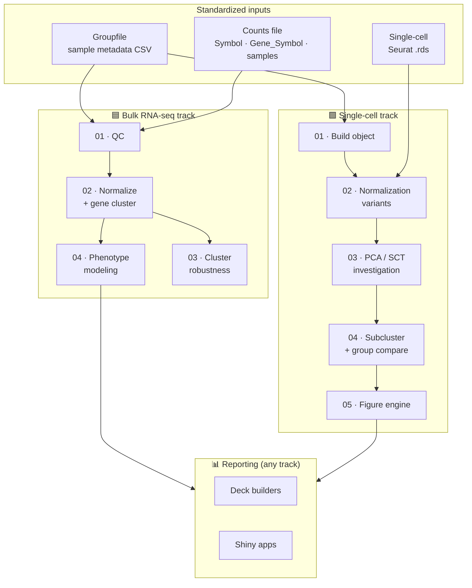

# 🧬 GenoBlok

**A modular toolkit for genomics analysis — snap together the blocks your project
needs instead of forking someone else's monolithic pipeline.**

Most genomics "pipelines" are one rigid script: great if your experiment looks
exactly like the author's, painful otherwise. GenoBlok takes the opposite stance.
Each analysis stage — QC, normalization, clustering, differential expression,
pathway enrichment, modeling, reporting — is a self-contained **block** with a
documented input and output. Blocks in a track all speak the same
[input contracts](docs/INPUT_SPECS.md), so you can pull just the ones you need,
arrange them in the order your study calls for, and swap one out for another
without rewriting everything around it.

> **The LEGO idea:** you don't use every block, and you don't use them in a fixed
> order. You pick the blocks that fit your data, snap them together into a
> *recipe*, and build the analysis your project actually needs.

---

## How it fits together



Pick an entry point that matches what you already have (see the
[compatibility table](docs/INPUT_SPECS.md#quick-compatibility-check)), then walk
down the track snapping in only the blocks you want.

## The three inputs that make blocks interchangeable

| Input | Format | Used by |
|-------|--------|---------|
| **Groupfile** | CSV; first column = sample ID, rest = metadata/phenotypes | both tracks |
| **Counts file** | `Symbol`, `Gene_Symbol`, then one column per sample | bulk track |
| **Single-cell object** | Seurat `.rds` (RNA assay; ADT/HTO auto-detected) | single-cell track |

Full spec and templates: **[docs/INPUT_SPECS.md](docs/INPUT_SPECS.md)** ·
real example groupfile: [`examples/example_pain_metadata.csv`](examples/example_pain_metadata.csv).

## The blocks

A one-line view; the full catalog (inputs, outputs, CLI) is in
**[docs/MODULE_CATALOG.md](docs/MODULE_CATALOG.md)**.

### 🟦 Bulk RNA-seq
| Block | Does |
|-------|------|
| `bulk/01_qc` | QC: filtering, expression histograms, outliers, correlation heatmap, PCA |
| `bulk/02_normalize_cluster` | VST normalize → variable-gene k-means → DESeq2 (continuous & group) → GSEA |
| `bulk/03_robustness` | Reproducibility of gene clusters across timepoints (projection, ARI, Sankey) |
| `bulk/04_modeling` | Leakage-safe ML modeling of a phenotype from cluster z-scores (Python) |

### 🟩 Single-cell (CITE-seq / scRNA / ADT / HTO)
| Block | Does |
|-------|------|
| `singlecell/01_build_object` | Merge hashed replicates → standardized Seurat object (mito/ribo, demux) |
| `singlecell/02_normalization_variants` | Compare merged / SCTv2 / RPCA / Harmony on identical params |
| `singlecell/03_pca_investigation` | Which genes drive each PC pre/post-SCT; dims×res sweep |
| `singlecell/04_subclustering` | Subcluster a lineage; group comparison via propeller + MASC + pseudobulk DESeq2 |
| `singlecell/05_figures_report` | One-shot figure engine → PNGs, tables, auto-filled PowerPoint |

### 📊 Reporting (track-agnostic)
| Block | Does |
|-------|------|
| `report/decks` | Build captioned PowerPoint decks from a figure folder |
| `report/apps` | Interactive R Shiny explorer pattern |

## Recipes — blocks snapped together

A recipe is just a record of which blocks you chained and what you fed each one.
Two worked examples ship in [`examples/recipes/`](examples/recipes/):

- **[`bulk_continuous_phenotype.yaml`](examples/recipes/bulk_continuous_phenotype.yaml)** —
  QC → normalize + gene-cluster → phenotype regression → cross-timepoint robustness.
- **[`singlecell_group_comparison.yaml`](examples/recipes/singlecell_group_comparison.yaml)** —
  build object → pick normalization → investigate embedding → subcluster + compare → figures + deck.

To make your own: copy a recipe, delete the blocks you don't need, reorder the rest,
point the inputs at your files. That's the whole workflow.

## Quick start

```bash
git clone https://github.com/therron-tyler/GenoBlok.git
cd GenoBlok

# --- Bulk: QC your counts in one command ---
Rscript blocks/bulk/01_qc/BulkSeq_QC.R \
    my_cpm.txt my_raw_counts.csv examples/groupfile_template.csv qc_out/

# --- Single-cell: compare normalizations on a merged object ---
Rscript blocks/singlecell/02_normalization_variants/compare_normalization_variants.R \
    --input_rds Merged.rds --out_dir norm_out/ --pca_dims "1:9,11:12;1:12" --variant all
```

Most R blocks are CLI scripts (`optparse`) designed to run on an HPC/SLURM node;
each script's header block documents its exact arguments and an example `sbatch` call.

## Requirements

- **R ≥ 4.2** with Seurat, SeuratObject, DESeq2, limma, edgeR, fgsea, msigdbr,
  harmony, glmGamPoi, sctransform, speckle, lme4, clustree, pheatmap, and tidyverse
  packages (per-block `library()` calls list exactly what each needs).
- **Python ≥ 3.10** with numpy, pandas, scikit-learn, scipy, statsmodels, matplotlib,
  and python-pptx (for the deck builders).
- Built and tested in a Linux/SLURM environment; the R blocks set a custom
  `.libPaths()` you should adapt to your cluster.

## Repository layout

```
GenoBlok/
├── README.md                  ← you are here
├── docs/
│   ├── INPUT_SPECS.md         ← the three input contracts + compatibility table
│   └── MODULE_CATALOG.md      ← every block: inputs, outputs, CLI
├── examples/
│   ├── example_pain_metadata.csv   ← real example groupfile
│   ├── groupfile_template.csv
│   ├── counts_template_bulk.csv
│   └── recipes/               ← worked block-chain recipes (YAML)
└── blocks/
    ├── bulk/        {01_qc, 02_normalize_cluster, 03_robustness, 04_modeling}
    ├── singlecell/  {01_build_object … 05_figures_report}
    └── report/      {decks, apps}
```

## Design principles

1. **One block, one job, one documented I/O.** A block is useful on its own and
   composable with others.
2. **Standardized inputs over bespoke glue.** Conform your data to three formats once;
   every block in the track then just works.
3. **Honest statistics by default.** Small-n modeling uses nested CV with all
   preprocessing inside the fold; proportion testing offers propeller *and* MASC;
   DE is pseudobulk. The blocks bias toward not fooling you.
4. **Reproducible + reportable.** Blocks emit both figures and the CSVs behind them,
   and the reporting blocks turn those into shareable decks and apps.

## Related repositories

These started as GenoBlok-style analyses but grew self-contained enough to live
on their own:

- **MaxOrigami** — ATAC-seq → 3D genome (TAD/Hi-C) prediction (Nextflow)
- **BS-seq Pipeline** — RRBS → differential methylation → methylation×expression (Nextflow)
- **Myeloid Fate-Mapping Explorer** — interactive Shiny reporter browser
- **scHTO-Recovery** — SNP-consensus rescue of HTO-ambiguous single cells

## License

MIT — see [LICENSE](LICENSE).

## Citation

If GenoBlok blocks contribute to your work, please cite this repository and the
underlying tools each block wraps (Seurat, DESeq2, fgsea, Harmony, propeller, etc.).
